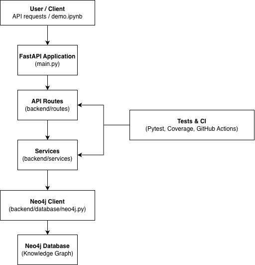

[](https://github.com/elisemyr/knowledge_graphs_project/actions/workflows/tests.yml)
[](https://github.com/elisemyr/knowledge_graphs_project/actions/workflows/lint.yml)

# University Course Prerequisite Planner

A comprehensive knowledge graph system for managing university course prerequisites, student eligibility, degree planning, and academic scheduling using **Neo4j** and **FastAPI**. This project provides intelligent course recommendation, schedule optimization, and graduation path analysis through graph-based algorithms.

---

## Table of Contents

- [Overview](#overview)
- [Features](#features)
- [Architecture](#architecture)
- [Project Structure](#project-structure)
- [Installation & Setup](#installation--setup)
- [Data Model](#data-model)
- [API Endpoints](#api-endpoints)
- [Graph Data Science](#graph-data-science)
- [Testing](#testing)
- [Docker Deployment](#docker-deployment)
- [Development](#development)
- [Documentation](#documentation)

---

## Overview

This project builds a knowledge graph of university courses, students, programs, and semesters using Neo4j. It provides a RESTful API for:

- **Prerequisite Management**: Track and query course prerequisites (direct and transitive)
- **Student Eligibility**: Validate if students can enroll in courses based on completed prerequisites
- **Degree Planning**: Generate optimal course sequences for degree completion
- **Schedule Optimization**: Create balanced semester schedules respecting prerequisites and course availability
- **Graduation Paths**: Analyze multiple paths to degree completion
- **Advanced Analytics**: Identify bottleneck courses, recommend courses, and analyze curriculum structure

The system uses **Neo4j Graph Data Science (GDS)** library for advanced graph algorithms including PageRank, degree centrality, and shortest path analysis.

---

## Features

### Core Functionality

✅ **Prerequisite Management**
- Direct and transitive prerequisite queries
- Cycle detection in prerequisite graphs
- Prerequisite validation for course enrollment

✅ **Student Services**
- Student eligibility checking
- Completed course tracking
- Course enrollment validation

✅ **Degree Planning**
- Optimal course sequence generation
- Multi-semester planning
- Prerequisite-aware scheduling

✅ **Schedule Optimization**
- Balanced course load distribution
- Semester availability consideration
- Credit hour management
- Topological sorting for prerequisite ordering

✅ **Graduation Paths**
- Multiple path analysis
- Time-to-graduation estimation
- Course dependency visualization

✅ **Advanced Analytics**
- Bottleneck course identification
- Personalized course recommendations with readiness scores
- Course depth analysis (prerequisite chain depth)
- Comprehensive student progress summaries

✅ **Graph Data Science**
- PageRank for course importance
- Degree centrality for bottleneck detection
- Shortest path algorithms for prerequisite chains

---

## Architecture

The project follows a **layered architecture** separating concerns:

```
┌─────────────────────────────────────┐
│         FastAPI Routes              │
│  (eligibility, degree_planner,      │
│   schedule_optimizer, etc.)         │
└──────────────┬──────────────────────┘
               │
┌──────────────▼──────────────────────┐
│      Service Layer                   │
│  (Business Logic & Cypher Queries)   │
└──────────────┬──────────────────────┘
               │
┌──────────────▼──────────────────────┐
│      Database Layer                  │
│      (Neo4j Client)                  │
└──────────────┬──────────────────────┘
               │
┌──────────────▼──────────────────────┐
│         Neo4j Database               │
│  (Graph Storage & GDS Library)      │
└─────────────────────────────────────┘
```

**Key Components:**

- **Routes** (`backend/routes/`): FastAPI route handlers organized by feature
- **Services** (`backend/services/`): Business logic and Cypher query execution
- **Models** (`backend/models/`): Pydantic models for request/response validation
- **Database** (`backend/database/`): Neo4j connection and client management



---

## Project Structure

```
knowledge_graphs_project/
│
├── backend/                          # Main application code
│   ├── __init__.py
│   ├── database/                     # Database layer
│   │   ├── __init__.py
│   │   └── neo4j.py                  # Neo4j client wrapper
│   │
│   ├── models/                       # Pydantic models
│   │   ├── __init__.py
│   │   ├── eligibility.py            # Eligibility response models
│   │   └── schedule.py               # Schedule optimization models
│   │
│   ├── routes/                       # FastAPI route handlers
│   │   ├── __init__.py
│   │   ├── eligibility.py            # Student eligibility endpoints
│   │   ├── degree_planner.py        # Degree planning endpoints
│   │   ├── graduation_paths.py       # Graduation path analysis
│   │   ├── schedule_optimizer.py     # Schedule optimization
│   │   └── advanced_queries.py      # Advanced analytics endpoints
│   │
│   └── services/                     # Business logic layer
│       ├── __init__.py
│       ├── prerequisites.py          # Core prerequisite queries
│       ├── eligibility_service.py    # Eligibility checking logic
│       ├── degree_planner_service.py # Degree planning algorithms
│       ├── graduation_paths_service.py # Path generation
│       ├── schedule_optimizer_service.py # Schedule optimization
│       └── advanced_queries_service.py # Advanced analytics
│
├── data/                             # Data files
│   ├── courses_prerequisites.csv     # Course prerequisite data
│   ├── degree_requirements.csv      # Degree requirement mappings
│   ├── degrees.csv                  # Degree program data
│   ├── student_enrollments.csv      # Student enrollment records
│   └── students.csv                 # Student information
│
├── scripts/                          # Utility scripts
│   ├── seed_data.py                  # Main data seeding script
│   ├── seed_extra_data.py           # Additional data seeding
│   └── gds/                          # Graph Data Science queries
│       ├── degree.cypher            # Degree centrality queries
│       ├── pagerank.cypher          # PageRank queries
│       ├── project_graph.cypher     # Graph projection
│       └── shortest_path.cypher     # Shortest path queries
│
├── tests/                            # Test suite
│   ├── __init__.py
│   ├── conftest.py                  # Pytest configuration
│   ├── test_app.py                  # API endpoint tests
│   ├── test_schedule_optimizer.py   # Schedule optimizer tests
│   └── unit/                        # Unit tests
│       └── test_prerequisites.py    # Prerequisite service tests
│
├── docs/                             # Documentation
│   ├── graph_schema.md              # Graph schema documentation
│   ├── advanced_queries_doc.md      # Advanced query examples
│   ├── constraints_justifications.md # Database constraints
│   └── architecture_diagram.png     # Architecture visualization
│
├── main.py                           # FastAPI application entry point
├── requirements.txt                  # Python dependencies
├── Dockerfile                        # Docker image definition
├── docker-compose.yml               # Docker Compose configuration
├── Makefile                         # Development commands
├── pytest.ini                       # Pytest configuration
└── README.md                        # This file
```

---

## Installation & Setup

### Prerequisites

- **Python 3.12+**
- **Docker** and **Docker Compose** (for Neo4j)
- **Neo4j 5.x** (via Docker)

### Step 1: Clone the Repository

```bash
git clone <repository-url>
cd knowledge_graphs_project
```

### Step 2: Create Virtual Environment

```bash
python3 -m venv .venv
source .venv/bin/activate  # On Windows: .venv\Scripts\activate
```

### Step 3: Install Dependencies

```bash
pip install --upgrade pip
pip install -r requirements.txt
```

**Key Dependencies:**
- `fastapi` - Web framework
- `uvicorn` - ASGI server
- `neo4j` - Neo4j Python driver
- `pydantic` - Data validation
- `pytest` - Testing framework
- `httpx` - HTTP client for testing

### Step 4: Start Neo4j with Docker Compose

```bash
docker compose up -d neo4j
```

This starts Neo4j with:
- **HTTP Interface**: http://localhost:7474
- **Bolt Protocol**: bolt://localhost:7687
- **Plugins**: APOC and Graph Data Science (GDS)

**Default Credentials:**
- Username: `neo4j`
- Password: `password`

### Step 5: Seed the Database

```bash
source .venv/bin/activate
python scripts/seed_data.py
```

The seed script will:
- Create constraints and indexes
- Load courses from CSV
- Create prerequisite relationships
- Load students, programs, and semesters
- Set up enrollment data

**Expected Output:**
```
Creating constraints...
Loading CSV...
Inserted 500 courses
Inserted 350 prerequisite edges
Inserted 100 students
Inserted 50 programs
```

### Step 6: Verify Data in Neo4j Browser

Open http://localhost:7474 and run:

```cypher
// Count nodes
MATCH (c:Course) RETURN count(c) as courses;
MATCH (s:Student) RETURN count(s) as students;

// View sample relationships
MATCH (c:Course)-[:PRE_REQUIRES]->(p:Course)
RETURN c, p LIMIT 20;
```

### Step 7: Run the API Server

```bash
# Using uvicorn directly
uvicorn main:app --reload --host 0.0.0.0 --port 8001

# Or using Makefile
make run
```

The API will be available at:
- **API**: http://localhost:8001
- **Interactive Docs**: http://localhost:8001/docs
- **Health Check**: http://localhost:8001/health

---

## Data Model

The knowledge graph consists of four main node types and their relationships:

### Node Types

#### 1. **Course**
Represents a university course.

**Properties:**
- `code` (string, unique) - Course code (e.g., "CS 225")
- `name` (string) - Course name
- `credits` (integer) - Credit hours
- `department` (string) - Department code

#### 2. **Student**
Represents a student.

**Properties:**
- `student_id` (string, unique) - Student identifier
- `name` (string) - Student name
- `program_name` (string) - Enrolled program
- `entry_year` (integer) - Entry year

#### 3. **Program**
Represents a degree program.

**Properties:**
- `name` (string, unique) - Program name
- `type` (string) - Degree type (BSc, MSc, etc.)
- `department` (string) - Department

#### 4. **Semester**
Represents an academic semester.

**Properties:**
- `id` (string, unique) - Semester ID (e.g., "FALL_2024")
- `name` (string) - Semester name
- `year` (integer) - Year
- `term` (string) - Term (Fall, Spring, Summer)
- `order` (integer) - Chronological order

### Relationship Types

- **`(:Course)-[:PRE_REQUIRES]->(:Course)`** - Prerequisite relationship
- **`(:Student)-[:HAS_COMPLETED]->(:Course)`** - Completed course
- **`(:Student)-[:TAKES]->(:Course)`** - Current enrollment
- **`(:Course)-[:PART_OF]->(:Program)`** - Course belongs to program
- **`(:Course)-[:OFFERED_IN]->(:Semester)`** - Course offered in semester

For detailed schema documentation, see [`docs/graph_schema.md`](docs/graph_schema.md).

---

## API Endpoints

### Base URL
```
http://localhost:8001
```

### Core Endpoints

#### Root & Health

**`GET /`**
- Returns API information and version

**`GET /health`**
- Health check for API and Neo4j connection
- Response: `{"status": "ok", "neo4j_ok": true}`

#### Prerequisites

**`GET /courses/{course_code}/prerequisites?all={true|false}`**
- Get prerequisites for a course
- `all=true`: Transitive prerequisites (all levels)
- `all=false`: Direct prerequisites only
- Example: `/courses/CS%20225/prerequisites?all=true`

**`GET /courses/cycles?limit=20`**
- Detect cycles in prerequisite graph
- Returns list of circular dependencies

**`GET /students/{student_id}/can_take/{course_code}`**
- Check if student can enroll in a course
- Validates prerequisites against completed courses

**`POST /validation/prerequisites`**
- Validate prerequisites for a course
- Request body:
  ```json
  {
    "target_course": "CS 225",
    "completed_courses": ["CS 125", "MATH 241"]
  }
  ```
- Response:
  ```json
  {
    "course": "CS 225",
    "can_take": true,
    "required_prerequisites": ["CS 125", "MATH 241"],
    "missing_prerequisites": [],
    "completed_courses": ["CS 125", "MATH 241"]
  }
  ```

### Student Eligibility (`/api/students`)

**`GET /api/students/{student_id}/eligibility?course_id={course_code}`**
- Check student eligibility for a specific course
- Returns eligibility status and missing prerequisites

### Degree Planning (`/api/students`)

**`GET /api/students/{student_id}/plan/sequence?target={program_name}`**
- Generate optimal course sequence for degree completion
- Returns semester-by-semester plan

### Graduation Paths (`/api/students`)

**`GET /api/students/{student_id}/paths/graduation`**
- Analyze multiple paths to graduation
- Returns different course sequences to complete degree

### Schedule Optimization (`/api/students`)

**`GET /api/students/{student_id}/schedule/optimize`**
- Generate optimized semester schedule
- Query parameters:
  - `max_courses_per_semester` (default: 5)
  - `max_credits_per_semester` (default: 18)
  - `target_semesters` (default: 8)
  - `start_semester` (default: "FALL_2024")
- Example: `/api/students/S001/schedule/optimize?max_courses_per_semester=5&target_semesters=8`

**`GET /api/students/{student_id}/schedule/semesters`**
- Get available semesters with course offerings
- Parameters: `start_semester`, `limit`

### Advanced Queries (`/api/advanced`)

**`GET /api/advanced/bottleneck-courses`**
- Identify bottleneck courses in curriculum
- Parameters:
  - `min_dependents` (default: 3) - Minimum courses this unlocks
  - `min_prerequisites` (default: 2) - Minimum prerequisites required
  - `limit` (default: 10)
- Returns courses that block many other courses

**`GET /api/advanced/students/{student_id}/recommendations`**
- Get personalized course recommendations
- Parameters:
  - `semester_id` (default: "FALL_2024")
  - `min_readiness` (default: 75) - Minimum readiness score (0-100)
  - `limit` (default: 15)
- Returns courses with readiness scores based on completed prerequisites

**`GET /api/advanced/students/{student_id}/course-depth`**
- Organize courses by prerequisite depth
- Parameters: `limit` (default: 20)
- Categorizes courses as: "Ready Now", "Almost Ready", "Plan Soon", "Plan Later"

**`GET /api/advanced/students/{student_id}/summary`**
- Comprehensive student progress summary
- Combines recommendations, course depth, and progress metrics
- Parameters: `semester_id` (default: "FALL_2024")

### Interactive API Documentation

FastAPI provides automatic interactive documentation:
- **Swagger UI**: http://localhost:8001/docs
- **ReDoc**: http://localhost:8001/redoc

---

## Graph Data Science

The project uses **Neo4j Graph Data Science (GDS)** library for advanced graph analytics.

### Algorithms

1. **PageRank**
   - Identifies structurally important courses
   - Highlights courses that unlock many academic paths
   - Query: `scripts/gds/pagerank.cypher`

2. **Degree Centrality**
   - Finds prerequisite hubs and bottleneck courses
   - Identifies courses with many incoming/outgoing relationships
   - Query: `scripts/gds/degree.cypher`

3. **Shortest Path (Dijkstra)**
   - Computes minimal prerequisite chains between courses
   - Finds optimal course sequences
   - Query: `scripts/gds/shortest_path.cypher`

### Graph Projection

The GDS library requires an in-memory projection:
- **Nodes**: `Course`
- **Relationships**: `PRE_REQUIRES` (directed)
- Projection script: `scripts/gds/project_graph.cypher`

### Usage Example

```cypher
// Project the graph
CALL gds.graph.project(
  'course-prerequisites',
  'Course',
  'PRE_REQUIRES'
);

// Run PageRank
CALL gds.pageRank.stream('course-prerequisites')
YIELD nodeId, score
RETURN gds.util.asNode(nodeId).code AS course, score
ORDER BY score DESC
LIMIT 10;
```

---

## Testing

### Run Tests

```bash
# Run all tests
pytest

# Run with coverage
pytest --cov=backend --cov-report=html

# Run specific test file
pytest tests/test_app.py

# Run with verbose output
pytest -v
```

### Test Structure

- **`tests/test_app.py`** - API endpoint integration tests
- **`tests/test_schedule_optimizer.py`** - Schedule optimization tests
- **`tests/unit/test_prerequisites.py`** - Prerequisite service unit tests
- **`tests/conftest.py`** - Pytest fixtures and configuration

### Test Configuration

Test configuration is in `pytest.ini`. Tests use a separate Neo4j test database or mock the database connection.

---

## Docker Deployment

### Docker Compose

The project includes a complete Docker Compose setup:

```bash
# Start all services (Neo4j + API)
docker compose up -d

# View logs
docker compose logs -f

# Stop services
docker compose down
```

**Services:**
1. **neo4j** - Neo4j database with GDS plugin
2. **seed** - Data seeding service (runs once)
3. **kgfx** - FastAPI application

### Environment Variables

Create a `.env` file:

```env
NEO4J_URI=bolt://neo4j:7687
NEO4J_USER=neo4j
NEO4J_PASSWORD=password
NEO4J_DATABASE=neo4j
GRAPH_API_PORT=8001
REPO=docker.io/asabourdin
TAG=graph-api:universityplanner-project
```

### Build Docker Image

```bash
# Build image
make docker-build

# Or manually
docker build -t graph-api:universityplanner-project .
```

### Run with Docker Compose

```bash
# Start with environment file
make docker-compose-up

# Or manually
docker compose --env-file .env up
```

---

## Development

### Makefile Commands

```bash
make help              # Show all available commands
make venv              # Create virtual environment
make install           # Install dependencies
make run               # Run FastAPI server
make lint              # Run pylint
make format            # Format code with black
make clean             # Remove caches and temp files
make tree              # Show project structure
make docker-build      # Build Docker image
make docker-compose-up # Start Docker Compose
make docker-compose-down # Stop Docker Compose
```

### Code Style

- **Formatter**: Black (line length: 120)
- **Linter**: Pylint
- **Type Checking**: Pydantic models for validation

### Development Workflow

1. **Create feature branch**
   ```bash
   git checkout -b feature/new-feature
   ```

2. **Make changes and test**
   ```bash
   make format
   make lint
   pytest
   ```

3. **Run locally**
   ```bash
   make run
   ```

4. **Test API endpoints**
   - Use http://localhost:8001/docs for interactive testing
   - Or use curl/Postman

### Adding New Endpoints

1. Create service in `backend/services/`
2. Create route in `backend/routes/`
3. Add Pydantic models in `backend/models/` if needed
4. Register router in `main.py`
5. Add tests in `tests/`

---

## Documentation

### Project Documentation

- **[Graph Schema](docs/graph_schema.md)** - Complete graph data model
- **[Advanced Queries](docs/advanced_queries_doc.md)** - Complex Cypher query examples
- **[Constraints](docs/constraints_justifications.md)** - Database constraints and indexes

### External Resources

- [Neo4j Documentation](https://neo4j.com/docs/)
- [Neo4j Graph Data Science](https://neo4j.com/docs/graph-data-science/)
- [FastAPI Documentation](https://fastapi.tiangolo.com/)
- [Cypher Query Language](https://neo4j.com/docs/cypher-manual/)

---

## Project Status

| Component | Status |
|-----------|--------|
| Neo4j driver setup | ✅ Done |
| Data seeding | ✅ Done |
| Constraints + indexes | ✅ Done |
| Graph schema | ✅ Done |
| Core Cypher queries | ✅ Done |
| Prerequisite validation | ✅ Done |
| Cycle detection | ✅ Done |
| Student eligibility | ✅ Done |
| Degree planning | ✅ Done |
| Schedule optimization | ✅ Done |
| Graduation paths | ✅ Done |
| Advanced analytics | ✅ Done |
| Graph Data Science | ✅ Done |
| API endpoints | ✅ Done |
| Testing | ✅ Done |
| Docker deployment | ✅ Done |
| Documentation | ✅ Done |

---

## License

[Add your license information here]

## Contributing

[Add contributing guidelines here]

## Contact

[Add contact information here]

---

**Built with ❤️ using Neo4j and FastAPI**
